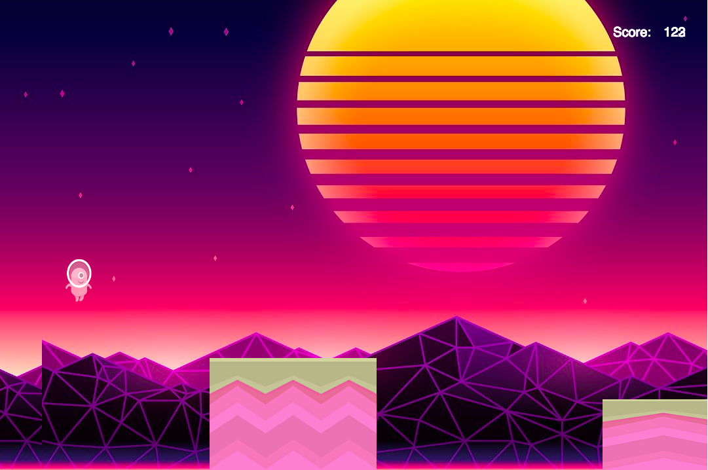

# Gravity Rush

[Gravity Rush Live](https://travishn.github.io/GravityRush/)

# Description
Gravity Rush is an endless side-scrolling video game inspired by Gravity Guy, where players have the ability to reverse the polarity of the world to manipulate their surroundings to survive. The goal of the game is to accrue as many points as possible before dying. As time progresses, the side-scrolling velocity will increase making it more difficult to survive.



# Project Design

Gravity Rush was designed and created over a span of 4 days. Prior to being created, a list of minimal viable products (MVPs) were composed in order to ensure a swift developmental process. 

# Architecture and Technologies

This project will be implemented with the following technologies:

- Vanilla JavaScript/p5.js for overall structure and game logic,
- `HTML5 Canvas` for DOM manipulation and rendering,
- `Web Audio API` for sound generation, processing and control. `WebAudioAPI` allows for simultaneous sounds with more dependable time triggering
- Webpack to bundle and serve up the various scripts.

In addition to the p5 library files, there will be three scripts involved in this project:

`sketch.js`: this script will handle the logic for creating and updating the necessary DOM elements.

`player.js`: this script will house the physics logic for the little alien creature.

`terrain.js`: this script script will house the logic for generating space terrains that the player can jump on

# Key Features

## Collision Detection Algorithm

```javascript
  hits(player) {
    if (this.flipped) 
      return ((player.x + player.playerWidth >= this.x &&
      player.x <= this.x + this.terrainWidth &&
      player.y <= this.y + this.terrainHeight));

    else {
      return (player.x + player.playerWidth > this.x && 
      player.x < this.x + this.terrainWidth &&
      player.y >= height - player.playerHeight - this.terrainHeight);
    }
  }

  function setLimit(targetTerrain) {
    if (targetTerrain.hits(player) && targetTerrain.flipped) {
      player.topLimit = targetTerrain.terrainHeight;
    } else if (targetTerrain.hits(player) && 
        targetTerrain.flipped === false) {
        player.bottomLimit = height - (targetTerrain.terrainHeight) 
        - player.playerHeight + 10;
    } else {
        player.topLimit = -100;
        player.bottomLimit = height + this.playerHeight;
    }
}
```

## Future Additions
* Develop algorithm that adjusts terrain velocity properly as time progresses
* Implement an enemy AI that chases after the player
* Create obstacles that can block the player
* Add more retro styling to game text
